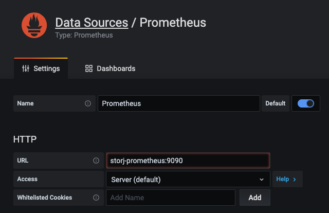

Storj Multinode Setup on Beastmode (incl. Prometheus/Grafana)
=========


## Featurelist:
* multi node setup per Host (with optional VPN Setup, if required)
* setup Watchtower Container (can be disabled)
* setup [Storj Exporter](https://github.com/anclrii/Storj-Exporter) Container per Node (and build, if required)
* setup Prometheus Container (can be disabled)
* setup Grafana for [Storj-Exporter-dashboard](https://github.com/anclrii/Storj-Exporter-dashboard) Container (can be disabled)


With this Ansiblerole you can setup multiple Storjnodes on Docker with monitoring based on [Storj Exporter](https://github.com/anclrii/Storj-Exporter) and [Storj-Exporter-dashboard](https://github.com/anclrii/Storj-Exporter-dashboard). Also it installs Storj Watchtower for automatic updates of your nodes.

In combination with Openvpn you can also Setup VPN for your Nodes, if required.

Requirements
------------

The target server needs to have Docker already installed and running.

Role Variables
--------------

### General Variables (valid for all Nodes)
|Variable|Description|Default value|Required|
| :- |:-| -:| -:|
|storj_wallet| ETH Walletadress for Payout|-|yes|
|storj_email| Emailadress of Nodeoperator|-|yes|
|storj_address|external IP or DNS|-|yes|
|storj_monitoring_path|Location where Monitoringdata will be Stored (Prometheus, Grafana)|-|yes|
|storj_prometheus_retention|Retention of Data which is stored in Prometheus|1y|no|
|storj_prometheus_external_exporter|List of external exporters (exporter_address, prometheus_label)|-|no|
|storj_prometheus_config_template|Jinja2 Template for prometheus.yml|-|no|
|storj_grafana_additional_networks|List of additional Dockernetworks which will be assigned to the Grafanacontainer (eg. for an Proxy)|-|no|
|storj_network_name|Name of Dockernetwork|storj|no|
|storj_network_subnet|Subnet of Dockernetwork |172.11.0.0/24|no|
|storj_network_gateway|Gateway of Dockernetwork | 172.11.0.1|no|
|storj_network_iprange|Range of Dockernetwork | 172.11.0.64/26|no|
|storj_deploy_watchtower|Shall it Deploy Watchtower?|true|no|
|storj_build_exporter|Shall it Build an Exporterimage?|false|no|
|storj_deploy_exporter|Shall it Deploy an Exporter per Node?|true|no|
|storj_deploy_monitoring|Shall it Deploy Grafana?|true|no|

### per Node Variables (storj_nodes)
|Variable|Description|Default value|Required|
| :- |:-| -:| -:|
|name|Containername of the Node|-|yes|
|ext_port_node| external/exposed Port of the Node|-|yes|
|ext_port_dashboard|external/exposed Port of the Dashboard|-|yes|
|ext_port_exporter|external/exposed Port of the Exporter|-|no|
|storagesize|Nodesize|-|yes|
|path|Root Directory for Node Storage|-|yes|
|setup|[Setup flag for an Node](https://documentation.storj.io/setup/cli/storage-node?_ga=2.80114071.1070953205.1610301181-2003123228.1608117935#setting-up-the-storage-node)|"false"|no|
|vpn_client|Name of the VPN Client Dockerimage|-|only for VPN Nodes|
|vpn_ext_address|external IP/Domain of VPN Server|-|only for VPN Nodes|

Dependencies
------------

A list of other roles hosted on Galaxy should go here, plus any details in regards to parameters that may need to be set for other roles, or variables that are used from other roles.

Example Ansible files
----------------
inventory
```yml
[storj]
<hostname-storj-server>
```

storj.yml
```yml
- hosts: storj
  roles:
    - { role: role-storj-beastmode}
```
group_vars/storj.yml

_Create an group_vars file (named like the servergroup in the inventory file) per server on which the Nodes are located._
```yml
#General per Node
storj_wallet: "0x0000000000000000000000000000000000000000"
storj_email: "your@email.net"
storj_address: "ip or dns"

storj_monitoring_path: /path/to/root/monitoring/storage

storj_nodes:
  - name: node1
    ext_port_node: 28900
    ext_port_dashboard: 14000
    storagesize: 12000GB
    path: /path/to/data/storage
    prometheus_label: Node 1
```

with VPN:
```yml
storj_nodes:
  - name: node1
    ext_port_node: 28900
    ext_port_dashboard: 14000
    ext_port_exporter: 9650
    storagesize: 12000GB
    path: /path/to/data/storage
    vpn_client: client1
    vpn_ext_address: 0.0.0.0
```

Example ansible run
```bash
 ansible-playbook -i inventory storj.yml
```

# Setup
## Storj Node

### Mounted Folders
|Folder|Description|
|:-|:-|
|{{ item.path }}/identity|Identity Files for the Node|
|{{ item.path }}/data|Datastorage of the Node|

### Setup
#### Requiremenents
* Configured [Portforwarding](https://documentation.storj.io/dependencies/port-forwarding), based on your defined Port (ext_port_node)
* STROJ [Identity](https://documentation.storj.io/dependencies/identity)
* Ensure your Disk is properly mounted and configured via fstab.

If you setup an new node you need to run the Playbook twice.
1. Configure all node variables
1. Store your identitie files of your node in your Ansible repository under files/storj/identities/\<nodename>
1. First run with the variable setup on true:
    ```yml
    setup: "true"
    ```
1. Delete the created container (storj-\<name\>) and remove the setup variable
1. Rerun the Playbook

This will maybe improved in the Future.
## VPN
This Role also provides Support for VPN Nodes, anyhow the Dependencies ar not covered by this Role, for Setup please follow the related Guides. Where required also provided some additional Snippets to get the Setup running. For now the Dashboard cannot be accessed from within the Local Network, anyhow you can create an PortForwarding for the Dashboard on the VPN Server (unsecured by default).

### Server
You can Setup an Openvpn Server with [openvpn-install](https://github.com/angristan/openvpn-install)

Following Configs have been Tested on Ubuntu 20.04.1 LTS
#### Fix Client IP
```bash
echo "ifconfig-push 10.8.0.10 255.255.255.0" > /etc/openvpn/ccd/client1
```

#### FW Config
```bash
apt-get install iptables-persistent
```

#### IPTables for Portforwarding and NAT
```bash
iptables -t nat -A POSTROUTING -s 10.8.0.10 -o <ext_ip_interface>  -j SNAT --to-source <ext_ip>
iptables -t nat -A PREROUTING -d <ext_ip> -p tcp --dport 28902 -j DNAT --to-dest 10.8.0.10:28967
iptables -t filter -A INPUT -p tcp -d 10.8.0.10 --dport 28967 -j ACCEPT
```

#### Save IPTables
```bash
iptables-save > /etc/iptables/rules.v4
```

### Client
Dockerimage for an [openvpn-client](https://github.com/dperson/openvpn-client)

In order to properly connect the VPN Client Container together with the Storjnode Container the VPN Client Contanier needs to be named like this:
```
vpn-<var-vpn_client>
```

## Exporter
In case you are running your nodes on an differen CPU architecture as amd64 this role can build an exporterimage, as the [one provided by anclrii](https://hub.docker.com/r/anclrii/storj-exporter/tags?page=1&ordering=last_updated&name=lates) has only an amd64 image ready.

## Prometheus
The Prometheus configuration will be generated automatically for you. If you have a multiserver Setup, you can also add additional exporters via the storj_prometheus_external_exporter variable. If the config changes, the prometheus container (_storj-prometheus_) needs to be restarted.

Also keep in mind if you change existing prometheus labels all histiorical data for that node will be lost (except you are relabeling them).

### Example
```yml
storj_prometheus_external_exporter:
  - exporter_address: my.node.dns.or.ip:9651
    prometheus_label: Node 1
```

### Mounted Folders
|Folder|Description|
|:-|:-|
|{{ storj_graphs_path }}/prometheus/conf|Prometheus config (prometheus.yml)|
|{{ storj_graphs_path }}/prometheus/data|Datastorage of Prometheus|


## Grafana
The [Storj-Exporter-dashboard](https://github.com/anclrii/Storj-Exporter-dashboard) needs to be imported via GUI manually. Also you have to connect grafana to prometheus on the first setup.



### Mounted Folders
|Folder|Description|
|:-|:-|
|"{{ storj_graphs_path }}/grafana/lib:/var/lib/grafana"|Grafana Plugins and Config|
